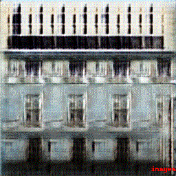

# HAMK Digital Bioeconomy Drone Image Data Analysis
To support the decision making in agricultural research, one may want to observe the evolution of vegetation from the high-altitude image. In particular, when utilizing the high-altitude drone images, we face the problem of low image resolution (in this instance, one pixel contains 4x4 cm, whereas the image is taken from 80m altitude), from which we can not derive the vegetation coverage within one pixel:

At the same time, we also have a small set of close-up calibration images, in which we can clearly observe whether the pixel is a vegetation or not, because the resolution is much higher:

We propose the following pipeline to infer the vegetation cover from the original high-altitude image:

Using the close-up calibration image, we label true-only instances of vegetation and soil (without edge labelling):

Then we use the classification and RGB color values of the pixels as dependent and independent variables respectively as inputs to the logistic regression. Then, we can label the model's predictions and thus infer the label mask and the vegetation cover:

The following stages of the approach are currently being researched and modified. The general gist of the next steps is:
 - Adapt Generative Adversarial Networks to our needs
     - We take tensorflow pix2pix as a starting point: https://www.tensorflow.org/tutorials/generative/pix2pix
     - However, we do not have the capacity to create a label mask for each of the close-up images to perform the training
     - Therefore, we replace the label mask with a random noise vector as an input for the GAN
     - Currently, the predictions of this approach look as follows:
     - 
 - 

## Installations

### Anaconda
The correct version of the required dependencies are contained in the 'requirements.txt'. Notice that running a single notebook may not mandate the installation of all the requirements.

The original image data is not licensed under the MIT license. It is derived from Häme University of Applied Sciences images (https://doi.org/10.23729/d083d6ad-aa68-4826-8792-7a169e2d2dd9), licensed under [Creative Commons Attribution 4.0 International (CC BY 4.0)](https://creativecommons.org/licenses/by/4.0/). For more details on the rights of use, check the LICENSE file.